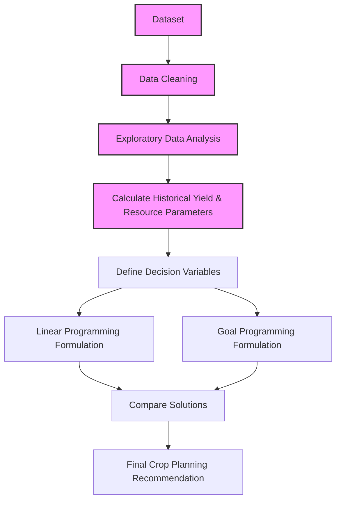

# Optimal Agricultural Crop Planning Using Linear Programming and Goal Programming
### First Review Presentation

**Team Members:**
- Sanjay (Dataset, Preprocessing, Statistics)
- Vignesh (Linear Programming, Formulation)
- Ruban (Goal Programming, Multiple Goals)
- Hari (UI, Dashboard, Integration)

---

## 1. Project Introduction

Agricultural crop planning is the process of deciding which crops to plant and how much land to allocate to each. 

In India, farmers have limited resources to work with:
- **Land:** A fixed amount of cultivable area.
- **Fertilizer:** Limited quantity or budget.
- **Pesticide:** Environmental and cost limits.
- **Water:** Dependent on rainfall and irrigation.

Different crops have varying yield rates and resource requirements. Our project aims to use **Operations Research** techniques to build a decision-support system. This system will analyze historical data to help decide how available land can be optimally allocated among selected crops to ensure good expected production while strictly respecting all resource limitations.

> **Speaker Notes:** 
> *Welcome everyone. Our project is about agricultural crop planning. Farmers always face the challenge of limited resources like land, fertilizers, pesticides, and water. Every crop needs a different amount of these resources and gives a different yield. Our project uses Operations Research to mathematically figure out the best way to allocate land to different crops so that we use our limited resources effectively and get good production.*

---

## 2. Problem Statement

**"Given historical crop and resource data, how can available land be allocated among selected crops to obtain good expected production while respecting resource limitations?"**

To solve this, we will later use:
- **Linear Programming (LP):** For maximizing expected total production.
- **Goal Programming (GP):** For finding a balanced solution when we have multiple competing goals (e.g., reaching a production target while minimizing excess fertilizer use).

*(Note: The actual optimization algorithms will be implemented in the Final Review.)*

> **Speaker Notes:** 
> *Our main problem statement asks how we can divide a fixed amount of land among various crops to get good production without running out of resources. Later in the final project, we will use Linear Programming to maximize the production, and Goal Programming to balance multiple targets, like keeping fertilizer usage below a certain level while still meeting a production goal.*

---

## 3. Project Significance

Why is this project useful?
- **Better utilization of resources:** Prevents overuse of fertilizers/pesticides and ensures land is not wasted.
- **Data-driven planning:** Moves away from guesswork by using 23 years of historical agricultural data.
- **Understanding patterns:** Helps us understand how factors like rainfall and season affect crop yield.
- **Scenario comparison:** Allows users to test different constraints (e.g., what if we have 20% less fertilizer this year?).
- **Real-world OR application:** Demonstrates how mathematical Operations Research can solve a critical, real-world agricultural problem.

> **Speaker Notes:** 
> *This project is significant because it brings data-driven decision-making to agriculture. Instead of guessing, we use 23 years of historical data to understand crop patterns. It helps prevent wasting resources and shows exactly how Operations Research concepts taught in our course can solve real-world problems.*

---

## 4. Dataset Section

**Dataset Used:** Agricultural Crop Yield in Indian States Dataset (1997–2020)

**Dataset Statistics:**
- **Number of Rows:** ~19,691
- **Number of Columns:** 10
- **Data Types:** Categorical (Crop, State, Season), Numerical (Area, Production, Annual_Rainfall, Fertilizer, Pesticide, Yield)
- **Missing Values:** Handled/Cleaned

**Sample Data Overview:**

| Crop | Crop_Year | Season | State | Area (ha) | Production (tons) | Annual_Rainfall (mm) | Fertilizer (kg) | Pesticide (kg) | Yield (tons/ha) |
|---|---|---|---|---|---|---|---|---|---|
| Arecanut | 1997 | Whole Year | Assam | 73814 | 56708 | 2051.4 | 7024878.38 | 22882.34 | 0.796 |
| Arhar/Tur | 1997 | Kharif | Assam | 6637 | 4685 | 2051.4 | 631643.29 | 2057.47 | 0.710 |
| Coconut | 1997 | Whole Year | Assam | 19656 | 126905000 | 2051.4 | 1870661.52 | 6093.36 | 5238.05 |
| Jute | 1997 | Kharif | Assam | 94520 | 904095 | 2051.4 | 8995468.4 | 29301.2 | 9.919 |

> **Speaker Notes:** 
> *(Sanjay speaks here)* *We are using a dataset containing agricultural records from 1997 to 2020. We have successfully loaded and cleaned the data, which contains around 19,000 rows. The table shows a sample of the data. We have categorical data like state and crop, and numerical data for area, production, and rainfall.*

---

## 5. Dataset Explanation

To understand our formulation, here is what each column represents:
- **Crop:** The name of the crop being cultivated.
- **Crop_Year:** The year the crop was grown.
- **Season:** The agricultural season (e.g., Kharif or Rabi).
- **State:** The Indian state where the cultivation took place.
- **Area:** The total cultivated land area, measured in hectares.
- **Production:** The total harvested output, measured in metric tons.
- **Annual_Rainfall:** The amount of rain received in that region, in millimeters.
- **Fertilizer:** Total fertilizer used for that crop area, in kilograms.
- **Pesticide:** Total pesticide used for that crop area, in kilograms.
- **Yield:** The production efficiency, calculated as Production per unit Area (tons per hectare).

> **Speaker Notes:** 
> *To keep things simple: 'Area' is our land in hectares, 'Production' is our output in metric tons, and 'Yield' tells us how many tons we get per hectare. We also have columns tracking exactly how much fertilizer and pesticide were used on that area. We will use these columns to calculate the average requirements for our optimization model later.*

---

## 6. Questions We Are Trying To Answer

### A. Dataset Analysis Questions (Addressed in First Review)
- Which crops have the highest average yield?
- Which crops have the highest total production?
- How does crop production vary across different states?
- How does production vary by season?
- What is the relationship between rainfall and crop yield?
- How much fertilizer and pesticide are associated with different crops?

### B. Optimization Questions (To be addressed in Final Project)
- Which crops appear more suitable when land is strictly limited?
- How can available land eventually be allocated among selected crops?
- How can we maximize expected production under land, fertilizer, and pesticide constraints?
- How can we balance multiple objectives (e.g., high production vs. low chemical use) using Goal Programming?

> **Speaker Notes:** 
> *Our project answers two sets of questions. The first set is about understanding the historical data—like which crop has the best yield or how rainfall affects production. We have started analyzing these. The second set involves optimization—how to actually distribute land to maximize production under strict constraints. We will answer the optimization questions in our Final Review.*

---

## 7. Methodology

*(Highlighted boxes indicate current First Review progress)*

> **Speaker Notes:** 
> *This flowchart shows our complete methodology. Right now, for the first review, we have completed dataset collection, cleaning, and basic exploratory analysis. Our next immediate step is to calculate the exact resource parameters, which will then feed into our Linear and Goal Programming models for the final review.*

---

## 8. Operations Research Concept

How does Operations Research apply to our project?

**1. Decision Variables:**
These represent what we are trying to decide. In our case, it is the amount of land (in hectares) allocated to each crop.
*Example:* 
- `x1` = hectares allocated to Rice
- `x2` = hectares allocated to Maize

**2. Objective Function:**
The ultimate goal of our model. 
*Later, we will aim to Maximize Expected Total Crop Production.*

**3. Constraints:**
The strict limits we cannot exceed.
- **Land Constraint:** Total allocated hectares cannot exceed available farm land.
- **Fertilizer Limit:** Total fertilizer needed cannot exceed available stock.
- **Pesticide Limit:** Total pesticide needed cannot exceed environmental limits.
- **Non-negativity:** We cannot allocate negative land (`x1, x2 >= 0`).

**Why Goal Programming?**
In real farming, we often have multiple competing goals. We want high production, but we might also want to minimize chemical usage or ensure a minimum quota of wheat. When multiple goals exist, Goal Programming helps find the most balanced solution by minimizing the deviations from our targets.

> **Speaker Notes:** 
> *(Vignesh and Ruban speak here)* *To formulate this mathematically, our decision variables, 'x', represent the hectares of land given to each crop. Our objective will be to maximize the total yield. However, we are restricted by constraints: we only have so much land, fertilizer, and pesticide. Furthermore, we plan to implement Goal Programming because a farmer doesn't just want raw production; they want a balance between reaching a production target and minimizing harmful chemical usage.*

---

## 9. Tools and Technologies

- **Python:** The main programming language for logic and data processing.
- **Pandas:** For loading, cleaning, and analyzing the historical dataset.
- **NumPy:** For high-performance numerical calculations and parameter estimations.
- **PuLP / OR-Tools:** The Python libraries we will use in the final phase to solve the Linear and Goal Programming models.
- **Streamlit:** To build the user interface and dashboard.
- **Plotly:** For creating professional, interactive data visualizations.
- **Antigravity:** AI-assisted development for coding, testing, and debugging.

> **Speaker Notes:** 
> *We chose Python because of its strong data science ecosystem. We use Pandas and Numpy for handling the data. For the Operations Research part, we plan to use PuLP or Google OR-Tools. The final user interface will be built using Streamlit, with interactive charts generated by Plotly.*

---

## 10. Proposed Final System

*(Conceptual Design for Final Review)*

The final application will be an interactive dashboard. The user flow will be:
1. **Inputs:** User selects a State, Season, and specific Crops.
2. **Constraints:** User enters their available Land limit, Fertilizer limit, and Pesticide limit.
3. **Engine:** The system runs both Linear Programming and Goal Programming in the background.
4. **Outputs:** The dashboard displays the optimal land allocation side-by-side, comparing the LP results (max production) against the GP results (balanced goals).

> **Speaker Notes:** 
> *(Hari speaks here)* *This is the conceptual design of our final system. It will be a web dashboard where a farmer or planner can input their state, select the crops they want to grow, and enter their available resources. The system will then run our OR models and spit out a clear recommendation on exactly how many hectares to assign to each crop.*

---

## 11. Team Contribution

- **Sanjay:** Responsible for the Dataset, Data preprocessing, Exploratory Statistics, Charts, and Parameter calculations. *(First Review Focus)*
- **Vignesh:** Responsible for Linear Programming formulation, defining Decision variables, Objective function, and Constraints.
- **Ruban:** Responsible for Goal Programming formulation, defining Multiple goals, Deviation variables, and Priorities/weights.
- **Hari:** Responsible for the UI and integration, building the Streamlit dashboard, handling User inputs, and Connecting modules.

> **Speaker Notes:** 
> *Our work is clearly divided. Sanjay handles all data-related tasks which is our focus today. Vignesh and Ruban are working on the mathematical formulations for LP and GP, respectively. Finally, Hari is responsible for wrapping all our logic into the Streamlit dashboard for the final review.*

---

## 12. Expected Final Output

By the Final Review, our project will produce:
- **Optimal Crop Allocation:** Exact hectares recommended for each crop.
- **Resource Usage Reports:** Expected production, land used, fertilizer used, and pesticide used.
- **Goal Programming Solution:** A balanced plan respecting multiple targets.
- **Comparison:** A clear comparison between LP (pure maximization) and GP (balanced).
- **Dashboard:** A complete, user-friendly UI for decision support.

> **Speaker Notes:** 
> *When we return for the final review, we expect to demonstrate a fully working system that outputs exact land allocations, resource usage summaries, and a comparison between our two OR approaches through a polished dashboard.*

---

## 13. First Review Conclusion & Boundary

**First Review Focus:**
We have successfully established the problem, acquired and analyzed the dataset, defined our research questions, finalized our methodology, and designed the planned Operations Research mathematical approach.

**Final Review Boundary:**
The implementation of the actual Linear Programming solver, Goal Programming solver, optimization results, and the interactive dashboard will be completed and demonstrated in the Final Review.

**Thank You.**

> **Speaker Notes:** 
> *To conclude, for this first review we have focused on understanding the problem, analyzing our dataset, and setting up the mathematical foundation. We know exactly what variables and constraints to use. In the final review, we will show you the running algorithms and the final dashboard. Thank you.*
